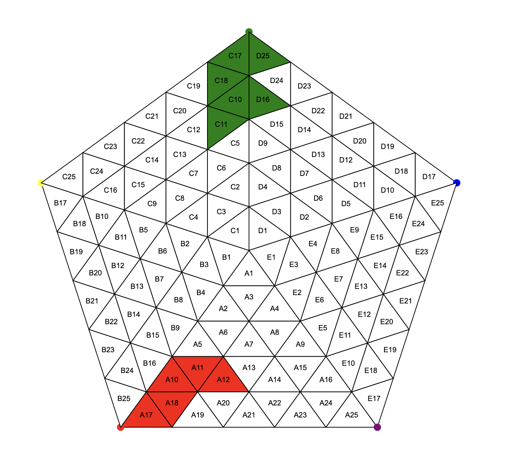

# 레인보우 펜타곤 (Rainbow Pentagon)



레인보우 펜타곤은 '더 브레이니(The Brainy)' 동아리의 박철현, 한상현이 만든 5인용 더 지니어스류 게임입니다. 이 프로젝트는 레인보우 펜타곤 게임의 딜링 보조를 위한 툴입니다.  
자세한 룰은 docs 폴더 내 pdf 파일 참고 바랍니다.  

## 소개

레인보우 펜타곤은 정오각형 형태의 보드에서 5명의 플레이어가 각각의 색상으로 전략을 펼치는 보드 게임입니다. 플레이어들은 자신의 삼각형을 선택하고 색상을 칠하며, 특정 규칙에 따라 승부를 겨루게 됩니다.  

## 특징

- **인터랙티브 보드**: SVG로 구현된 보드에서 클릭하여 삼각형에 색상을 칠할 수 있습니다.  
- **다양한 색상 선택**: 빨강, 노랑, 초록, 파랑, 보라, 흰색 중 선택하여 칠할 수 있습니다.  
- **이미지 저장 기능**: 현재 보드의 상태를 SVG 이미지로 저장할 수 있습니다.  
- **크로스 플랫폼 지원**: Electron을 통해 윈도우 및 맥에서 실행 가능한 단일 프로그램 제공.  

## 실행 방법 for Mac
https://drive.google.com/file/d/1gm0QI_uyoaeVZUvll2aH_FJV9Kj8kaFK/view?usp=drive_link  
위 파일 다운로드 및 실행  

또는  

```bash
git clone https://github.com/yourusername/RainbowPentagon.git
cd RainbowPentagon
```
이후 terminal 에서  
```bash
python3 -m http.server 8080
# 이후 웹 브라우저에서 localhost:8080 으로 접속
```


## 설치 및 실행 방법 for Developer

### 1. 저장소 클론

```bash
git clone https://github.com/yourusername/RainbowPentagon.git
cd RainbowPentagon
```

### 2. 의존성 설치

```bash
npm install
```

### 3. 애플리케이션 실행

```bash
npm start
```

## 빌드 방법

Electron Packager를 사용하여 크로스 플랫폼 실행 파일을 만들 수 있습니다.  

### 1. Electron Packager 설치

```bash
npm install electron-packager --save-dev
```

### 2. 윈도우용 빌드

```bash
npx electron-packager . --platform=win32 --arch=x64
```

### 3. 맥OS용 빌드

```bash
npx electron-packager . --platform=darwin --arch=x64
```

### 4. 실행

```bash
./rainbowpentagon-darwin-x64/rainbowpentagon.app  
```
위 파일 실행

## 사용 방법

1. **색상 선택**: 화면 상단의 드롭다운 메뉴에서 사용할 색상을 선택합니다.  
2. **삼각형 칠하기**: 보드에서 원하는 삼각형을 클릭하여 선택한 색상으로 칠합니다.  
3. **이미지 저장**: '이미지 저장' 버튼을 클릭하여 현재 보드 상태를 SVG 이미지로 저장합니다.  

## 라이선스

더 지니어스 모티브 서울 연합 동아리 'The Brainy' 딜러 박철현  

## 기여자

- **박철현** (CreamMeatball) in 'The Brainy' - 개발자  
- **한상현** in 'The Brainy' - 원작자 (Rainbow Heptagon!)  

##


- 이메일: pch5445@gmail.com  
- 깃허브 이슈: [GitHub Issues](https://github.com/CreamMeatball/RainbowPentagon/issues)  

---